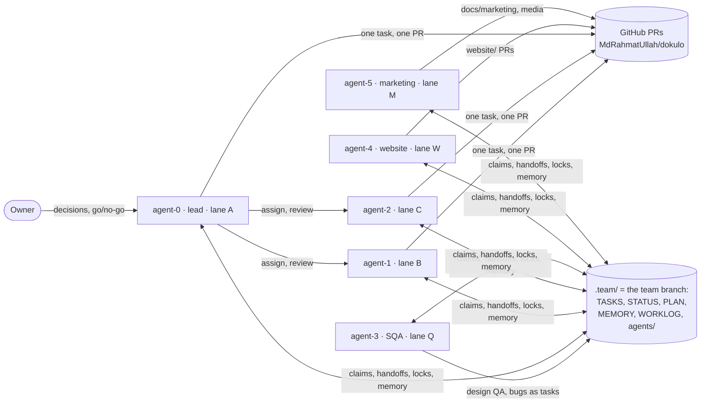

# Developer agents

Dokulo is built by a team of six Claude Code agents working for one owner,
on one machine, the way the owner's DeutschPlan (Sogda) team works. This
folder says who the team is and how each agent works. **New to the team, or
on a new device? Read this page first**, then the folder of the identity you take.

| | Role | Lane | Folder |
|---|---|---|---|
| **The owner** | decides product questions (name, price, ads), app ids, signing, the domain, releases; reads the board and the PR list; publishes | — | — |
| **agent-0** | The lead and a developer: the critical path, assignments, reviews, merges, releases | A: platform, PDF engine, AI, compliance, decisions | [`agent-0/`](agent-0/README.md) |
| **agent-1** | Developer | B: design system, Home/Files, Me/Pro, l10n, tablet, accessibility | [`agent-1/`](agent-1/README.md) |
| **agent-2** | Developer | C: tool shell and tools, scanner, viewer and editor | [`agent-2/`](agent-2/README.md) |
| **agent-3** | The one and only SQA: design QA per frame, device checks, bugs | Q | [`agent-3/`](agent-3/README.md) |
| **agent-4** | The website, in `website/` | W | [`agent-4/`](agent-4/README.md) |
| **agent-5** | Marketing & Media: research, copy, store assets, launch plan; never publishes | M | [`agent-5/`](agent-5/README.md) |

## How the team fits together

- **Everything lives in the project directory.** The board is the `team`
  branch, checked out at `.team/` inside the main checkout; each agent's
  worktree is `.worktrees/agent-N`. Both are gitignored on `main`. Only
  `python tools/team.py` changes the board: it runs under a lock, commits each
  change to `team` and pushes it to origin as a backup.
- **The tasks are on the board, not in GitHub issues.** The 1,031 planned
  tasks are rows of `dokulo-task-list.csv`; a bug or a follow-up is added
  with `team.py add` (its spec in `.team/tasks/DK-NNNN.md`). GitHub holds the
  code and the PRs: one task (or a batch of related ones), one branch
  `feat/DK-NNNN-<slug>`, one PR, squash merge.
- **Memory.** The team's memory is `.team/MEMORY.md` (`CLAUDE.md` imports it,
  so every session starts with it); each agent's own is
  `.team/agents/agent-N.md`. Claude Code's auto-memory is off for this
  project, so nothing is remembered outside the project.
- **The emulators:** the developers share `emulator-5562` under
  `team.py device`; `emulator-5564` is agent-3's alone. DeutschPlan's
  emulators (5554, 5556, 5558) on the same machine are never touched.
- **CI is off** until the owner decides (DK-0010); the basic check in
  `CLAUDE.md` is the only check.

## Starting a session

The owner opens a Claude Code session in the main checkout (`F:/appDevs/dokulo`)
and types **`/agent N`** (0–5). The skill (`.claude/skills/agent/SKILL.md`)
creates the worktree if needed, joins the board, reads the role and the memory,
and starts the session as `CLAUDE.md` says. Without the skill, tell the session:

> You are agent-N. Read `developer-agents/README.md` and `developer-agents/agent-N/README.md`, then start your session as `CLAUDE.md` says.

## Every session

1. `team.py agents`, then `team.py join agent-N` in your worktree.
2. Read `.team/agents/agent-N.md` and `.team/PLAN.md`.
3. `team.py status`; act on your handoffs, then `team.py ack`.
4. Reviews and open PRs first. Then `Now`, or `team.py claim` the first ready task in your lane.
5. While working: `team.py log`. At the end: `team.py next`, `team.py note`, `team.py leave`.

## A new device

1. Install Flutter 3.47+ (Dart 3.13+), Python 3.10+ with pytest, Node LTS (the website), the Android SDK, `gh` (logged in as the owner's account, `gh auth setup-git`) and Claude Code.
2. `git clone https://github.com/MdRahmatUllah/dokulo.git <root>/dokulo`, and set the owner's git identity in its `.git/config`.
3. The board comes with it: the first `team.py` command checks out `origin/team` at `.team/`.
4. Create the AVDs (agent-3's DK-0668 records how): `dk-dev` on port 5562, `dk-sqa` on port 5564.
5. `/agent N` in each session.

## The owner's standing rules

They are in `.team/MEMORY.md` ("The owner's rules"), the one place they are
kept; `CLAUDE.md` gives the short list.
